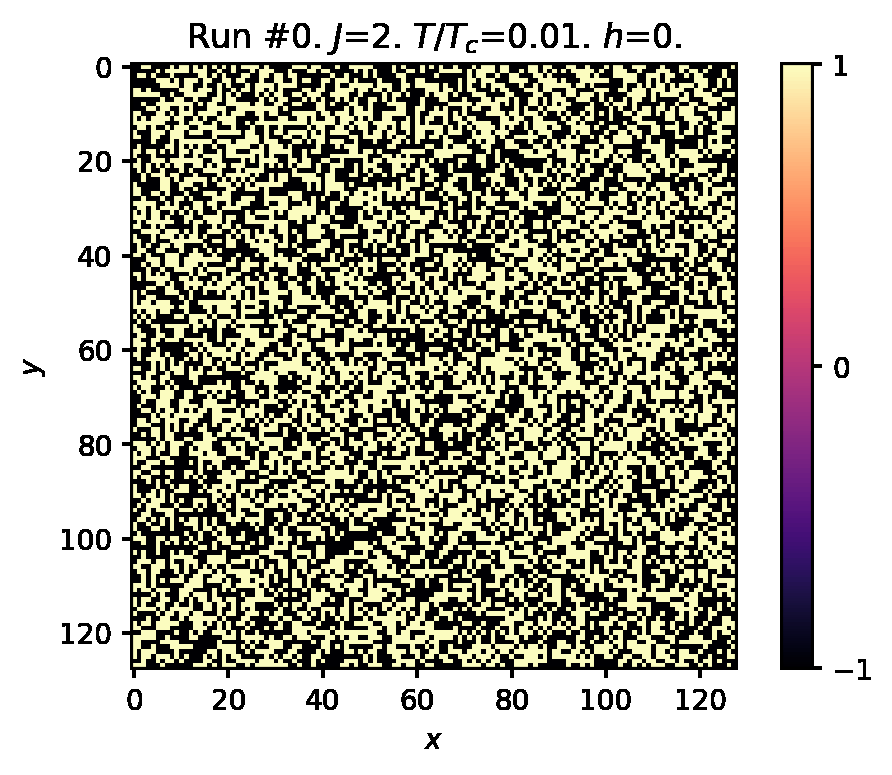
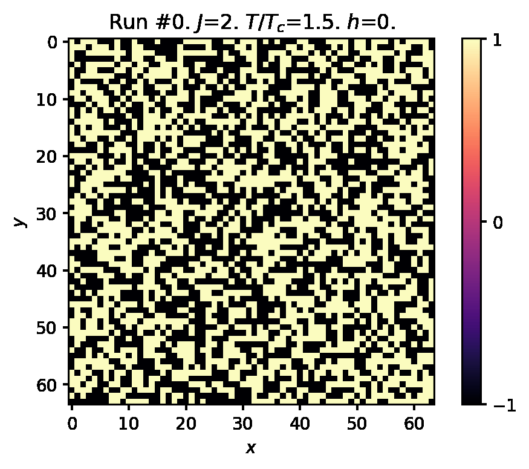
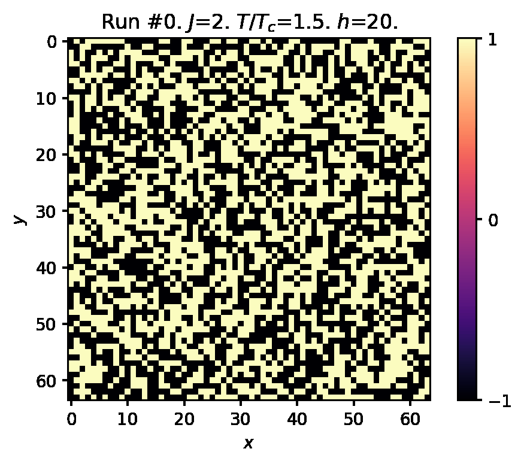
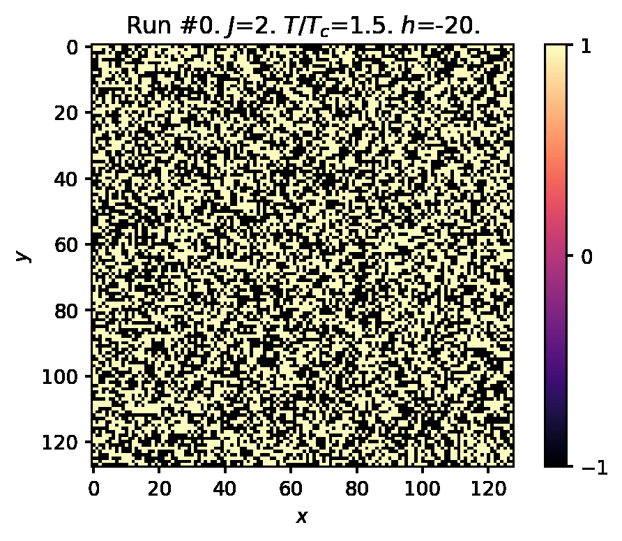

# AP3082 Project 2: Ising Model Q4 2021

## Authors

* [juandaanieel](https://github.com/juandaanieel)  
* [bernwo](https://github.com/bernwo)

## Programming language

[**Python**](https://www.python.org/) is used in this project which the lecture notes can be found [**here**](https://compphys.quantumtinkerer.tudelft.nl/proj2-intro-ising/).

## Dependencies

This project depends on the library `imageio`. You may need to run the following line to install the dependency.

```bash
sudo pip3 install imageio
```

## Journal

The journal documentating the progress of this project can be found [**here**](docs/journal.md).

### Milestones

* [**Week 1**](https://gitlab.kwant-project.org/computational_physics/projects/Project-2---Ising_juandaanieel_kwo/-/issues/1)
* [**Week 2**](https://gitlab.kwant-project.org/computational_physics/projects/Project-2---Ising_juandaanieel_kwo/-/issues/2)

## Simulations showcase

The resulting works here can also be found in the [**journal**](docs/journal.md) with more in depth explanation.


<br />

<br />